<p align="center">
  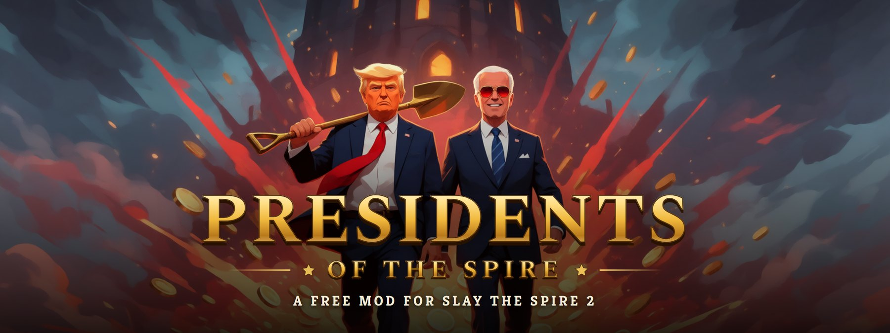
</p>

<p align="center">
  <a href="https://github.com/nexost/sts2-pres-mod/releases/latest"></a>
  
  
  
</p>

<h3 align="center">Two playable presidents for Slay the Spire 2.<br>Free, co-op ready, and built almost entirely by an AI agent in four days.</h3>

<p align="center">
  <a href="https://github.com/nexost/sts2-pres-mod/releases/latest"><b>Download</b></a> ·
  <a href="https://youtu.be/co-SsNDz3go"><b>Trailer</b></a> ·
  <a href="#-meet-the-candidates"><b>The characters</b></a> ·
  <a href="#-install"><b>Install</b></a> ·
  <a href="#-how-it-was-made-an-ai-agent-and-a-human-on-their-phone"><b>How it was made</b></a> ·
  <a href="#-contribute"><b>Contribute</b></a>
</p>

---

**The Donald** builds a wall that grows in stages, makes deals with his Gold and shows the Spire's worst monsters the door.
**Sleepy Joe** dozes off mid-fight, rambles through his cards, and wakes up as **Dark Brandon** with lasers for eyes.
They're complete characters in the style of the base game: 176 cards, 18 relics, 6 potions, their own mechanics,
art, effects and dialogue, balanced against the base game's heroes, and playable together in co-op.

> [!IMPORTANT]
> **Almost everything here was made by an AI agent.** The code, the card design, the balancing, the art, the visual
> effects, the installer, the documentation and the whole trailer were made by **Claude Opus 5.5** in Claude Code.
> One human steered it, mostly from a phone, in spare moments between the kids and the office.
> [How that worked ↓](#-how-it-was-made-an-ai-agent-and-a-human-on-their-phone)

## ▶ The trailer

<p align="center">
  <a href="https://youtu.be/co-SsNDz3go">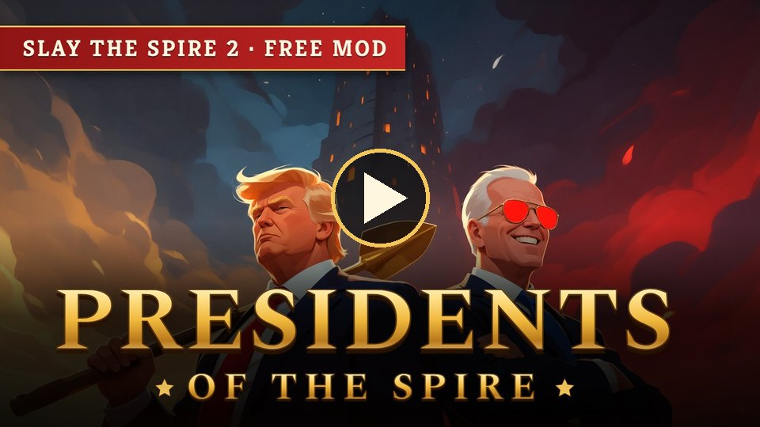</a>
</p>

Staged by a bot in the real game, narrated, scored, animated and edited by the agent. [How the trailer was made](docs/TRAILER.md).

## 🗳 Meet the candidates

### The Donald

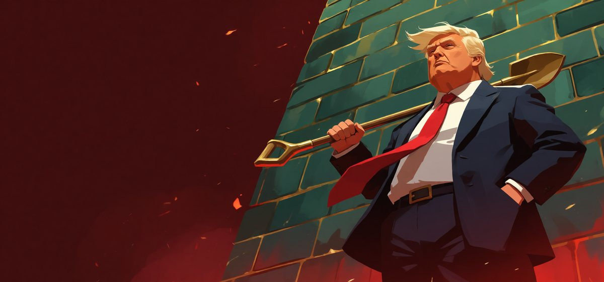

*"A tremendous businessman. The best, many people are saying."* 70 HP, 99 Gold, and a Golden Shovel.

- **🧱 The Wall.** Build raises it, and every 10 height is a section of Block at the end of your turn. It grows from a
  chain-link fence to a brick wall (+1 draw), a concrete wall (+1 Energy) and finally the **Big Beautiful Wall**, which
  damages every enemy each turn.
- **🚪 Deport.** Any enemy at or below 25% of its HP can be removed from the fight. A red **DENIED** stamp shows who's
  eligible. (Bosses are immune.)
- **💰 Deals.** Cards that spend Gold for big effects, Tariffs that pay you when enemies attack, relics that turn money into power.
- **🐦 Tweets.** A free token that hits every enemy, with cards that make more of them.

<table>
  <tr>
    <td width="50%">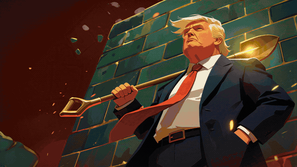</td>
    <td width="50%">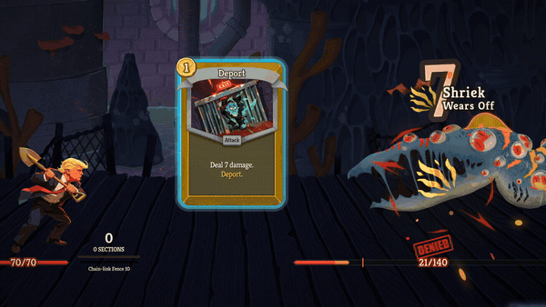</td>
  </tr>
  <tr>
    <td align="center"><sub>Four stages, one per card</sub></td>
    <td align="center"><sub>Deport and Mass Deportation</sub></td>
  </tr>
</table>

<p align="center">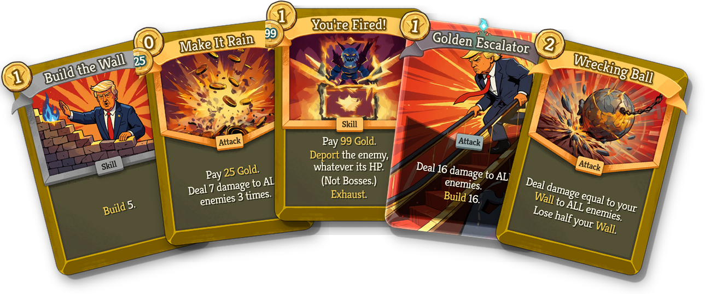</p>

### Sleepy Joe (and Dark Brandon)

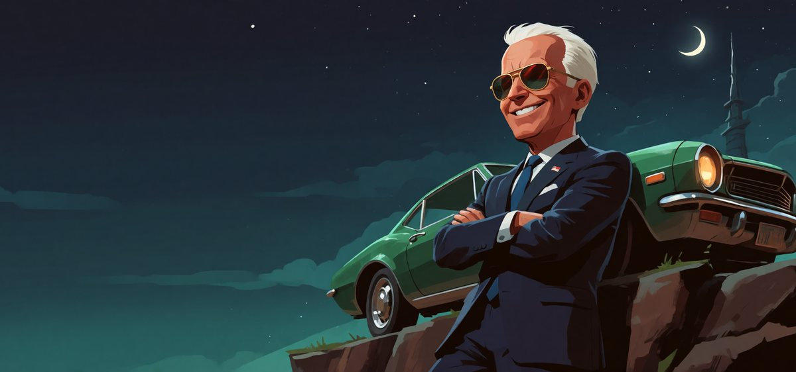

*"Here's the deal, folks: he's not asleep, he's resting his eyes."* 70 HP, 99 Gold, and Aviator Shades.

- **😴 Drowsy.** His cards make him Doze. At 10 Drowsy he nods off and his turn ends on the spot, so the meter is a
  timer you play around.
- **🕶 Dark Brandon.** When he wakes up, his aviators light up: **Laser Eyes** hit every enemy for his Drowsy, and for
  one turn he's Dark Brandon. Then he's sleepy again.
- **💬 Tangents.** Cards with two or three lines where only the lit line happens, and it moves on every time you play
  something else. As Dark Brandon, every line happens at once.

<table>
  <tr>
    <td width="50%">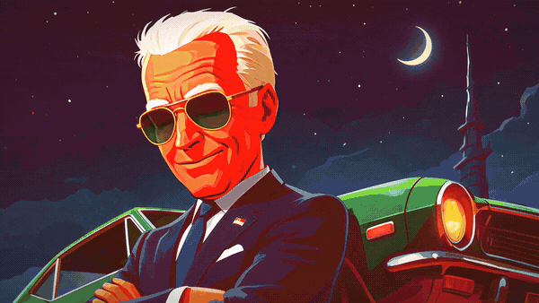</td>
    <td width="50%">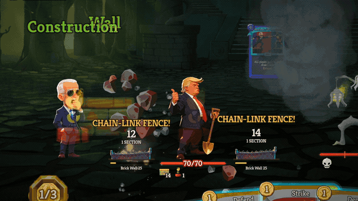</td>
  </tr>
  <tr>
    <td align="center"><sub>Don't wake him up</sub></td>
    <td align="center"><sub>Co-op: bipartisan infrastructure</sub></td>
  </tr>
</table>

<p align="center">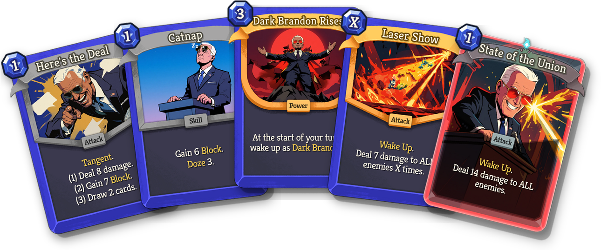</p>

### What's in the box

| | The Donald | Sleepy Joe |
|---|---|---|
| Cards | 88 + the Tweet token | 88 |
| Powers | 26 | 24 |
| Relics | 9 (Golden Shovel → Diamond Shovel) | 9 (Aviator Shades → Dark Aviators) |
| Potions | 3 | 3 |
| Play styles | Wall, Deport, Deals, Tweets | Dark Brandon, Power Nap, Tangents, General |
| Co-op cards | Coalition Wall, Trickle Down | Reach Across the Aisle |
| Art and effects | Every card, relic, potion and power; select screen, poses, shop and rest site; coins, stamps, tweets, gold bursts | The same, plus both forms, Z's and dusk as he dozes, the red laser, trains, limos and an ice cream truck |
| Dialogue | His own lines with Neow, every Ancient and the Architect | Same |

<p align="center">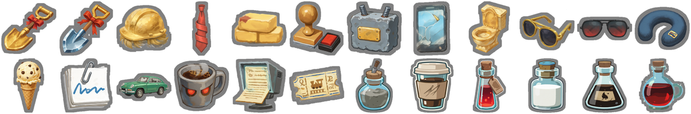</p>

Both are unlocked from the start, work in any co-op party, and never touch your normal saves (modded play uses its own
save profiles).

<p align="center">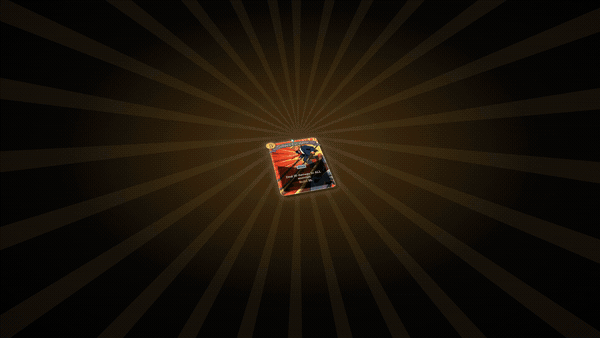</p>

## 💾 Install

**You need:** Slay the Spire 2 **v0.107.1 or later**, on Windows.

1. Download **`sts2-pres-mod-v1.1.0.zip`** from the [latest release](https://github.com/nexost/sts2-pres-mod/releases/latest) and unzip it.
2. Close the game.
3. Double-click **`install.cmd`**. It finds the game through Steam.
   (Or copy the `pres_mod` folder into `Slay the Spire 2\mods\` yourself.)
4. Start the game. The first time it sees mods, it asks you to allow them.
5. Pick **The Donald** or **Sleepy Joe** on the character select screen.

**Co-op:** every player needs the same version of the mod. Any mix of characters works.

**Uninstall:** double-click `uninstall.cmd`. It also cleans up runs that used the mod, locally and in Steam Cloud,
and keeps a backup. Options are in the `README.txt` inside the zip.

**Something wrong?** The game's log is `%APPDATA%\SlayTheSpire2\logs\godot.log`; lines with `pres_mod` are ours.
[Open an issue](https://github.com/nexost/sts2-pres-mod/issues) with them. If the game just updated, check for a new
version of the mod.

## 🤖 How it was made: an AI agent and a human on their phone

This project started as a test: **how far can an AI agent take a real creative project, end to end, with a human only
steering?** The human ([nexost](https://github.com/nexost)) wrote the brief, reviewed every step, played the builds and
made the taste calls. **Claude Opus 5.5**, working in Claude Code on one gaming PC, did the rest.

Nobody sat at a desk for this. The session ran with Remote Control on a phone, and the human checked in here and
there, between taking care of the kids and working at the office, to look at a review page and reply "continue" or
"no, make it deeper". Most of the time they weren't at the computer at all.

### Four days

| When | What the agent did |
|---|---|
| **Day 1**, by 1 AM | Decompiled the game (3,425 source files in 11 seconds), rebuilt it as an editable Godot project, found the spots a mod has to patch, made a test character, an installer and an uninstaller |
| Day 1, morning | Designed The Donald (88 cards, relics, potions, a Wall that grows in stages) against numbers mined from the base game's 5 heroes; built the mechanics, then all the content |
| Day 1, afternoon | Wrote a **balance bot** and ran it 9 games at a time; locked an art style that matches the game; built an **art review tool** |
| Day 1, 11 PM | Every card, relic, potion, power and painting generated, reviewed and wired into the game |
| **Day 2** | Turned the mod into a framework for any number of characters, shipped **v1.0.0**, then built **Sleepy Joe from scratch to final checks in about 13 hours**: design, mechanics, 88 cards, balance, 147 pieces of art |
| **Day 3** | Visual effects for both characters, shipped **v1.1.0**, and started the trailer: script, voice, music, a bot to film it |
| **Day 4** | Painted cinematic shots, the edit, the mix, the master, the thumbnail. And this page |

Every step ended with a report and a review page, and nothing moved on until the human said "continue". The full
record is in [the project plan](docs/00_project_plan.md), with a decision log of every call and why.

### What the agent built along the way

**Bots that play the game.** The mod carries a test harness that drives the real game: it plays every card base and
upgraded and checks the text (257 checks for Sleepy Joe), plays whole runs to a victory, and tests co-op by launching
two copies of the game that play together and compare the full game state every turn (0 desyncs). The **balance
bot** plays the new characters against Ironclad and Silent on the same seeds, nine games at once in a 3×3 grid of
muted windows: more than 300 runs across the two balance passes. The Donald lands between Silent and Ironclad, and
Sleepy Joe level with Ironclad, which was the target.

<p align="center">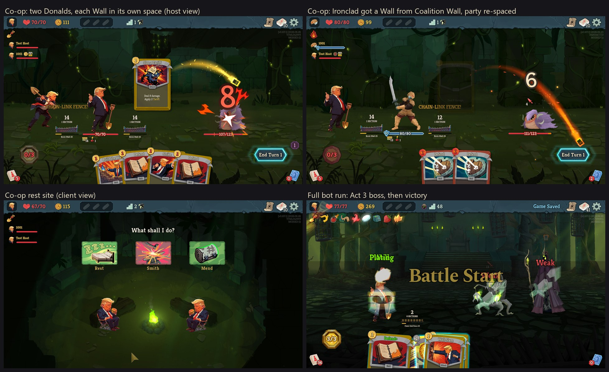</p>

**Art made on a gaming PC.** All the art is generated locally (Krea 2 in ComfyUI, on one RTX 4090), with the base
game's own art as the style reference so it blends in. The agent tried two approaches side by side (training a style
model on the game's art, or referencing it directly) and the human picked one. Then the agent wrote every prompt from
the card designs and built the review tool the human asked for, where they could generate, compare and keep versions
from their phone. Every final piece was kept by hand.

<p align="center">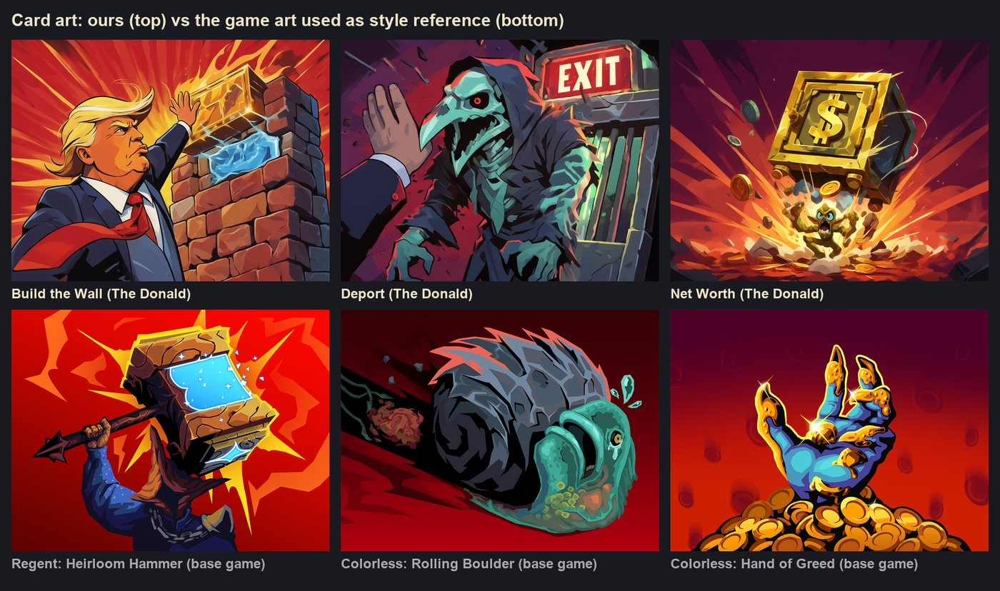</p>

**A trailer, from script to master.** A director bot inside the mod stages every shot in the real game and records it
in 4K at a locked 60 fps. The narrator is an AI voice (ElevenLabs). The music is generated locally (MiniMax Music 3),
and since the agent can't hear, it **reads the music as pictures**: spectrograms, loudness curves and beat grids,
which it used to pick takes, cut on the beat and find a seamless loop in the drop.

<p align="center">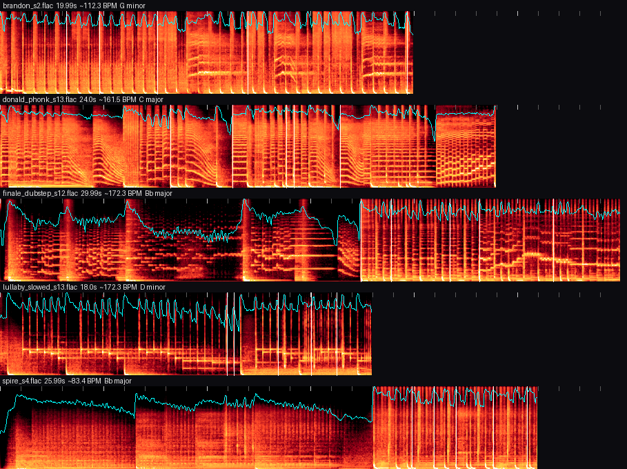</p>

The painted shots are the mod's own paintings brought to life with a local video model (MiniMax H3), then upscaled to
1440p (SeedVR2) and smoothed to 60 fps (RIFE). The edit itself is code: a Remotion project where every cut, zoom,
card slam and title is a line in a timeline file, set against contact sheets the agent made of every clip.

<table>
  <tr>
    <td width="50%">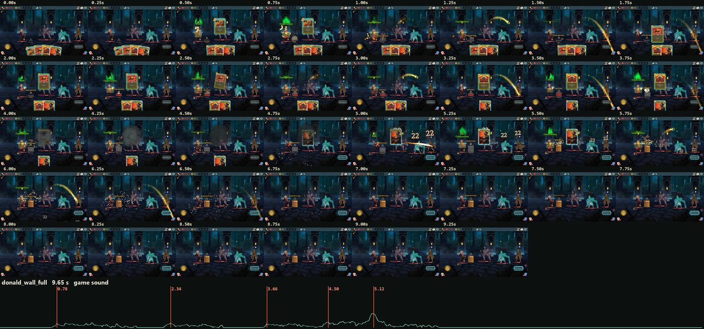</td>
    <td width="50%">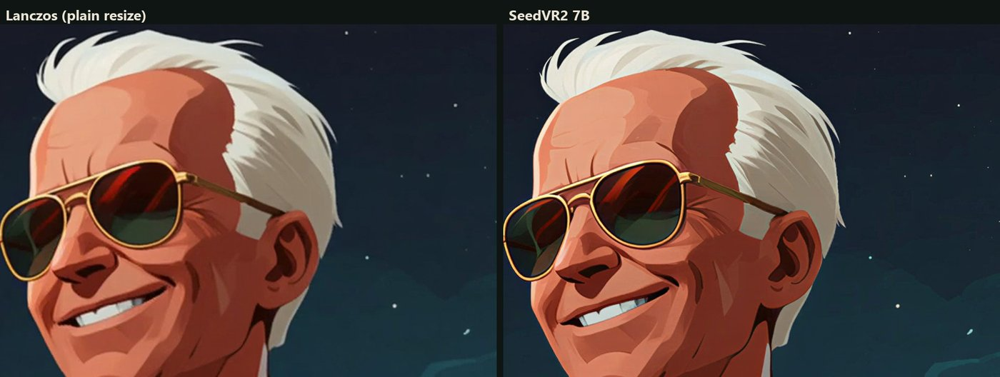</td>
  </tr>
  <tr>
    <td align="center"><sub>How the agent "watches" a clip to pick its cuts</sub></td>
    <td align="center"><sub>Plain resize vs. the AI upscale, 1:1 pixels</sub></td>
  </tr>
</table>

**Review pages for everything.** Card designs, art, music takes, footage, cinematics and every edit were published as
web pages the human could judge on a phone: a compendium of every card with its reasoning, dailies of every clip,
take-by-take comparisons.

<p align="center">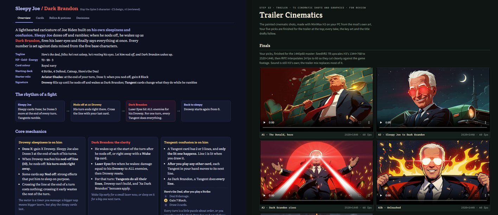</p>

### The human's part

It mattered more than the line count suggests. The human set the brief and the tone, and caught what a bot can't:
the co-op walls standing on the other player (from a screenshot), an extra "?" in the character roster, music that
sounded too happy ("make it deeper, harder, more deep fried"), hero cards in the trailer that went by too fast. When the human
said their own video-generation settings had given weak results, the agent didn't copy them: it researched, ran an A/B
test and switched to what looked best. Every piece of art, the narrator's voice, every music take and every
cinematic shot was picked by the human.

**Two rules held the whole way:** jokes land on the characters' public personas only, and walls and deportation only
ever hit the Spire's monsters. Nothing about real groups of people or real tragedies.

## 🤝 Contribute

- **Play it and report what breaks.** [Open an issue](https://github.com/nexost/sts2-pres-mod/issues) with what
  happened and the `pres_mod` lines from `godot.log`.
- **Balance and card ideas** are welcome as issues too: what felt strong, weak or unfun, and on which floor.
- **The next president.** The mod is a framework for more characters, with a step-by-step playbook
  ([ADDING_A_CHARACTER.md](docs/ADDING_A_CHARACTER.md)) and a scaffold script. Suggest one in an issue first so we can
  agree on the concept and the tone.
- **Code, art and fixes** by pull request: fork, set up with [SETUP.md](docs/SETUP.md) (you need the game; the
  decompiled game stays on your PC and is never committed), then run the tests (`test.py ui` and `test.py cards` for the
  character you touched).

**Bring your own agent.** The repo is written to be worked on by an AI agent as much as by a person.
[AGENTS.md](AGENTS.md) (read automatically by Claude Code through `CLAUDE.md`) tells an agent what to read for each
task, how the work is run and the pitfalls already paid for. Point yours at it and ask for a card, a fix or a whole
character, one step at a time, and review each step before it moves on. That's how this whole mod was made.

**House rules:** follow the tone rules above; never commit game files, saves or API keys; keep your agent to one step
at a time with a review after each.

## 🛠 For developers

One mod (id `pres_mod`), several characters. Targets StS2 **v0.107.1** (Godot 4.5.1 .NET, .NET 9), patched with Harmony.

| Character | Id | Status | Folder |
|---|---|---|---|
| **The Donald**: builds walls, makes deals, deports the Spire's riff-raff | `trump` | Since v1.0.0: 88 cards + the Tweet token, 9 relics, 3 potions, full art, co-op tested; visual effects in v1.1.0 | [`characters/trump/`](characters/trump/) |
| **Sleepy Joe** (Joe Biden): dozes off, rambles, wakes up as Dark Brandon | `biden` | v1.1.0: 88 cards, 9 relics, 3 potions, full art and effects, balanced, co-op tested | [`characters/biden/`](characters/biden/) |

**Start with [`docs/00_project_plan.md`](docs/00_project_plan.md)**: the plan, the status, the decisions and how to resume.
**New PC?** [`docs/SETUP.md`](docs/SETUP.md) goes from a fresh clone to a built and tested mod, and to making art.
**Using an AI agent?** Point it at [`AGENTS.md`](AGENTS.md): what to read for each task and the working rules.

### Documents

| File | What |
|---|---|
| [`AGENTS.md`](AGENTS.md) | For AI agents: what to read for each task, the working rules, pitfalls |
| [`docs/SETUP.md`](docs/SETUP.md) | New PC: requirements, tools, paths (`local_settings.json`), extracting the game, first build and test, ComfyUI and models |
| [`docs/00_project_plan.md`](docs/00_project_plan.md) | Master plan: steps, status, decision log, open items, how to resume |
| [`docs/GAME_UPDATES.md`](docs/GAME_UPDATES.md) | After a game update: re-extract, check what the mod relies on, diff, rebuild and test, rebalance |
| [`docs/FRAMEWORK.md`](docs/FRAMEWORK.md) | How the mod is built: shared code vs. character code, patches, scenes, build, tests, scripts |
| [`docs/ADDING_A_CHARACTER.md`](docs/ADDING_A_CHARACTER.md) | **The playbook for a new character**, from the scaffold to the final checks, with the pitfalls already hit |
| [`docs/ART_PIPELINE.md`](docs/ART_PIPELINE.md) | Making art: ComfyUI setup, what each character provides, recipes and destinations per kind, the review tool |
| [`docs/RELEASE_NOTES.md`](docs/RELEASE_NOTES.md) | What each version contains |
| [`docs/PUBLISHING.md`](docs/PUBLISHING.md) | Where the mod may be published (not Nexus), the release checklist, Steam Workshop steps |
| [`docs/TRAILER.md`](docs/TRAILER.md) | The trailer: how it was made (director bot, voice, music, painted shots, the Remotion edit), how to update it, the exports |
| [`docs/01_feasibility_report.md`](docs/01_feasibility_report.md), [`docs/02_step2_report.md`](docs/02_step2_report.md) | Steps 1–2: how the game works, the patches it needs, build, installer and uninstaller |
| [`docs/09_step9_report.md`](docs/09_step9_report.md) | Step 9: co-op testing, size, QA pass, packaging, where it can be published |
| [`docs/reference/`](docs/reference/) | Base-game data: balance benchmarks from the 5 characters, Ironclad's asset list |
| [`characters/trump/design/design.md`](characters/trump/design/design.md) | The Donald's design (v2): mechanics, play styles, relics, balance |
| [`characters/trump/design/cards.json`](characters/trump/design/cards.json) | **Source of truth** for The Donald's cards, relics and potions |
| [`characters/trump/docs/`](characters/trump/docs/) | The Donald's Step 4–7 reports and art boards |

### Layout

| Path | What |
|---|---|
| `mod.json` | Mod id, name, version, description, old ids the installer removes |
| `characters/<id>/` | One character: `character.json`, `design/`, `art/art_assets.json`, `localization/eng/`, `docs/` |
| `characters/_template/` | What `new_character.py` fills in for a new character |
| `mod/` | Godot asset project **and** C# project (`PresMod.csproj`); paths mirror the game's `res://` |
| `mod/pres_mod/src/` | Code: `Framework/` (shared by all characters), `Dev/` (tests, save cleanup), `Characters/<Class>/` (one folder each) |
| `mod/images`, `mod/scenes`, `mod/materials` | Assets at the exact paths the game loads for each character id |
| `scripts/` | Build, test, design, art and packaging tools; `presmod.py` is their shared config; `dist/` holds the installer and uninstaller |
| `trailer/` | The trailer's sources: treatment, audio and painted-shot briefs, `tools/` (sound, capture review, upscale, mix, export), `edit/` (Remotion) |
| `docs/readme/` | The images on this page |
| `re/`, `tools/`, `build/`, `backups/` | Decompiled game and unpacked PCK; Godot and GDRE; output; save backups (all git-ignored) |

### Commands

Scripts that work on one character take `-c <id>`; without it they use the first one (`trump`).

```bash
# New character (docs/ADDING_A_CHARACTER.md)
python scripts/new_character.py biden --class Biden --name "Sleepy Joe" --full-name "Joe Biden" --primary 4A55E6 --color-word navy

# Setup and game updates (docs/SETUP.md, docs/GAME_UPDATES.md)
python scripts/extract_game.py      # decompile + unpack the installed game into re/ (git-ignored)
python scripts/game_update_check.py # everything the mod relies on in the game still exists

# Build
python scripts/build.py              # build into build/dist/ (placeholders for missing art, character and ID checks)
python scripts/build.py --install    # build + install into the game
python scripts/build.py --zip        # also the release zip in build/release/ (+ Workshop preview image)

# Tests (the game runs in a test mode; saves go to modded_prestest/, never your real saves)
python scripts/test.py ui -c trump                 # walkthrough + the character's mechanics, with screenshots (~3 min)
python scripts/test.py cards PRESTEST1 -c trump    # every card base and upgraded, relics, potions, all text (~15 min)
python scripts/test.py cards PRESTEST1 relics      # just the relic and potion checks (~1 min)
python scripts/test.py autoslay SEED -c trump      # the game's bot plays a full run (god mode)
python scripts/test.py coop -c trump [IRONCLAD]    # two instances play a co-op fight; checks both see the same state (~4 min)
python scripts/test.py deportsweep SEED A,B        # Trump's own mode: Deport enemies one at a time in the listed encounters
python scripts/test.py balance TRUMP,IRONCLAD,SILENT 9 PREFIX 9 fullheal   # balance bot, 9 games at once, tiled + muted
python scripts/balance_report.py PREFIX            # compare balance batches
python scripts/test.py cleansaves [ID]             # clear test runs of a removed character (goes through the game for Steam Cloud)

# Design
python scripts/analyze_cards.py                    # mine base-game cards into build/analysis/ (the benchmarks)
python scripts/render_design.py -c trump           # cards.json -> card_list.md + validation
python scripts/render_gallery.py -c trump          # cards.json -> gallery.html
python scripts/render_compendium.py -c trump       # cards.json -> compendium.html (then republish)

# Art (docs/ART_PIPELINE.md)
python scripts/art_review.py [-c trump]            # review page for every character's art: keep / regenerate live (starts ComfyUI)
python scripts/make_placeholders.py [-c trump]     # stand-ins for missing art (the build runs it)

# Trailer (docs/TRAILER.md)
python scripts/trailer_capture.py SHOTS -c trump   # the director bot records gameplay shots in 4K at a fixed 60 fps
python trailer/tools/mix.py                        # the mix from trailer/edit/src/timeline.json, mastered to -14 LUFS
python trailer/tools/export.py trailer/edit/out/trailer_master.mov   # YouTube, Reddit and captioned files, thumbnail
```

**Updating art:**
1. Keep the new version in the review tool; it writes into `mod/`.
2. Run `python scripts/build.py --install` and restart the game.
3. Check with `test.py ui`.

Details: [ART_PIPELINE.md](docs/ART_PIPELINE.md) §5.

## Credits and legal

- **Made by** [Claude Opus 5.5](https://www.anthropic.com/claude) (Anthropic) in Claude Code, directed by [nexost](https://github.com/nexost).
- **Built with** Godot 4.5 and Harmony (the game's own modding stack), ILSpy and GDRE Tools (reading the game),
  ComfyUI with Krea 2 (art), MiniMax H3 and MiniMax Music 3 (painted shots and music), ElevenLabs (narration),
  SeedVR2 and RIFE (upscaling and frame interpolation), Remotion, ffmpeg and librosa (the trailer).
- **Slay the Spire 2** is made by Mega Crit. Presidents of the Spire is a **fan-made parody mod**, not affiliated with
  or endorsed by Mega Crit or by anyone it depicts.
